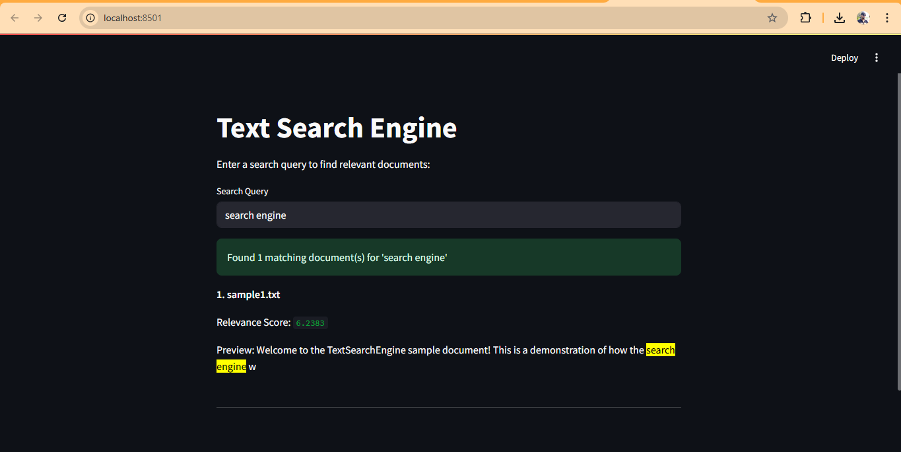
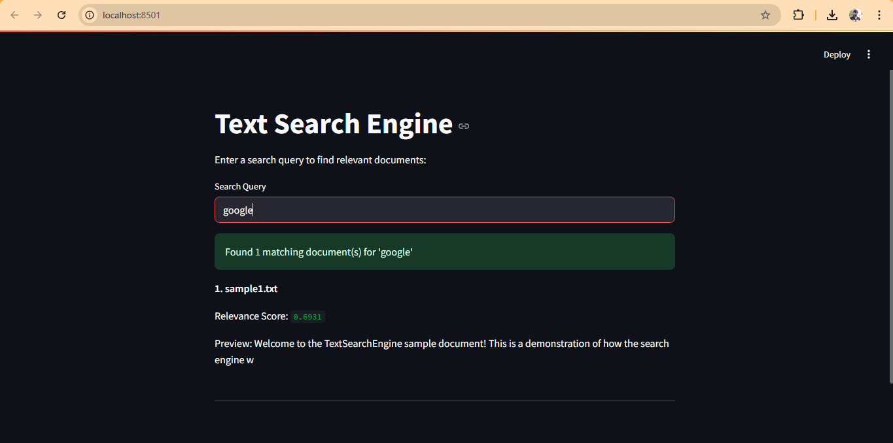

# TextSearchEngine

A command-line and web-based search engine for text documents. It allows users to search for keywords or phrases in `.txt` files, ranks results using TF-IDF, and provides keyword-highlighted previews. Includes both a CLI and a Streamlit web app.

Live Project Link(https://text-search-engine.streamlit.app/)

## What the Project Does
- Searches through text documents in the `documents/` folder
- Ranks results using TF-IDF (term frequency-inverse document frequency)
- Shows previews with highlighted keywords
- Offers both a command-line interface and a Streamlit web interface

## How to Run It

### 1. Install Dependencies
```bash
pip install -r requirements.txt
pip install streamlit nltk
python -c "import nltk; nltk.download('stopwords')"
```

### 2. Command-Line Usage
- **Basic search:**
  ```bash
  python main.py search "your keyword"
  ```
- **Ranked search (TF-IDF):**
  ```bash
  python main.py ranked-search "your keyword"
  ```
- **List documents:**
  ```bash
  python main.py list-docs
  ```

### 3. Run the Streamlit App
```bash
streamlit run streamlit_app.py
```

## Example Input/Output

**Example Input:**
- Search query: `search engine`

**Example Output:**





## Dependencies
- Python 3.7+
- click
- colorama
- rich
- nltk
- streamlit

## Add Your Own Documents
Place your `.txt` files in the `documents/` folder. The search engine will automatically index and search them.

---
MIT License 
